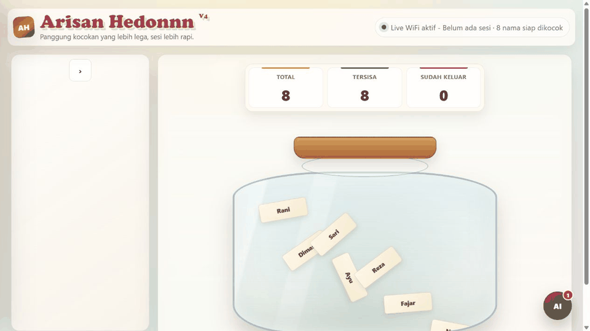
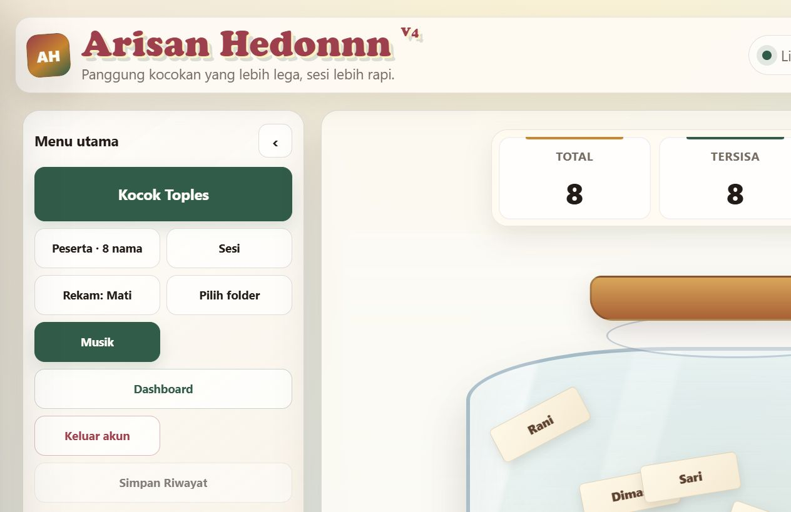
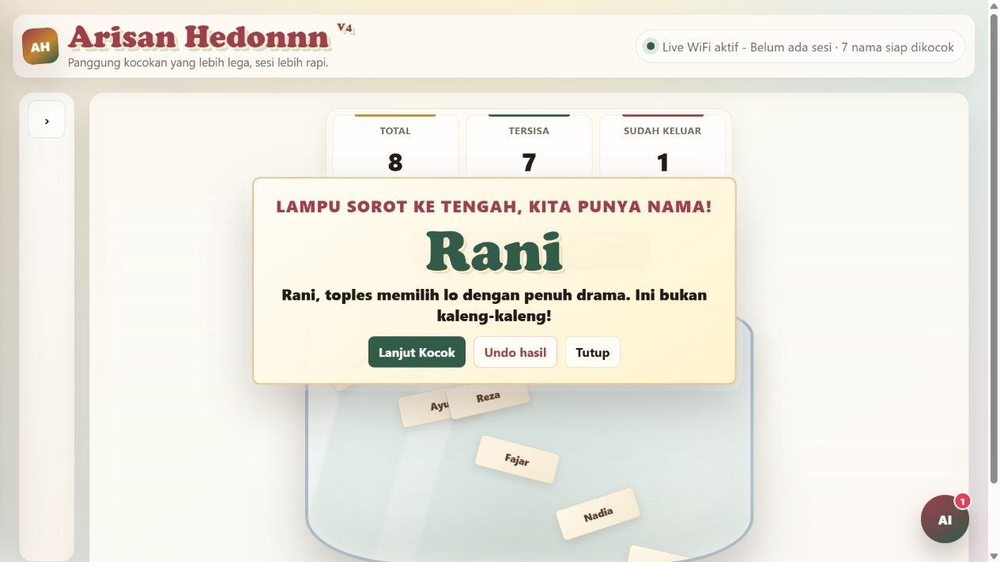
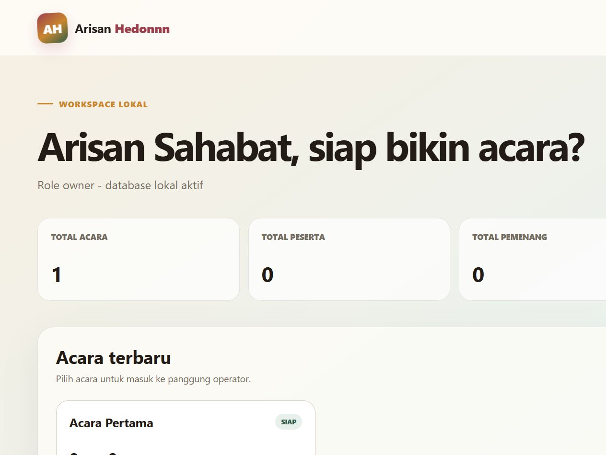

# Arisan Hedonnn

Aplikasi web arisan lokal dengan akun pengguna, workspace terpisah, dashboard acara, pengundian sinkron, dan penyimpanan SQLite. Dibuat agar operator bisa menjalankan acara dari satu komputer atau membagikan panggung melalui jaringan lokal.

## Fitur

- Akun lokal dengan password yang di-hash menggunakan PBKDF2.
- Acara terpisah dalam satu workspace.
- Mode pengundian random dan berurutan.
- Animasi pengundian, kartu pemenang, suara, dan confetti.
- Sinkronisasi panggung melalui jaringan lokal.
- Riwayat pemenang, log aktivitas, dan pemandu acara.
- Penyimpanan SQLite tanpa layanan cloud atau dependency Python tambahan.
- Perlindungan session, CSRF, Origin/Host, rate limit, dan isolasi workspace.

## Screenshot

### Panggung pengundian

### Pemenang

### Dashboard

## Menjalankan di Windows

1. Install [Python 3](https://www.python.org/downloads/) dan aktifkan opsi **Add Python to PATH**.
2. Download repository ini melalui **Code → Download ZIP**, lalu ekstrak.
3. Jalankan `START ARISAN.bat`.
4. Buka `http://127.0.0.1:8081/` jika browser tidak terbuka otomatis.
5. Buat akun lokal pertama, lalu buka acara dari dashboard.

Tidak ada perintah pemasangan package karena server hanya memakai Python standard library.

## Data dan backup

Data aplikasi disimpan dalam `arisan-hedonnn.db` di folder aplikasi. File database, session, log, PID, dan konfigurasi lokal dikecualikan dari Git. Untuk backup yang konsisten, hentikan server lalu salin file database ke tempat aman.

## Menjalankan untuk jaringan lokal

Launcher Windows akan menampilkan alamat jaringan yang bisa dibuka perangkat lain pada Wi-Fi yang sama. Jangan membuka port aplikasi langsung ke internet. Untuk deployment publik, gunakan reverse proxy HTTPS dan ikuti [DEPLOY-PRODUCTION.md](DEPLOY-PRODUCTION.md).

## Dokumentasi

- [Panduan instalasi lokal](INSTALL-V5.txt)
- [Panduan deployment produksi](DEPLOY-PRODUCTION.md)
- [Contoh environment produksi](production.env.example)

## Lisensi

Dirilis di bawah [MIT License](LICENSE). Silakan dipakai, dipelajari, dan dikembangkan.
